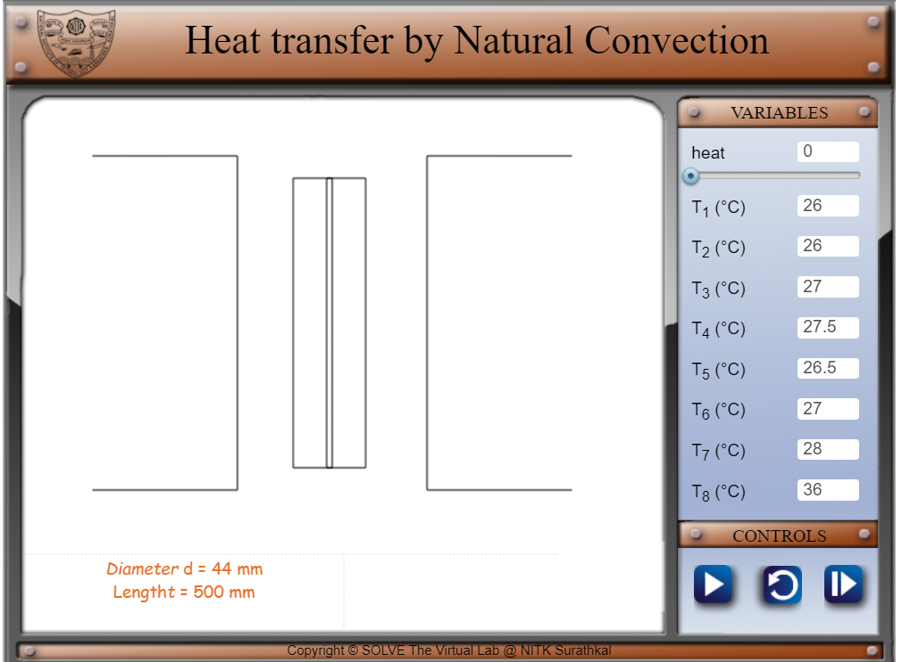
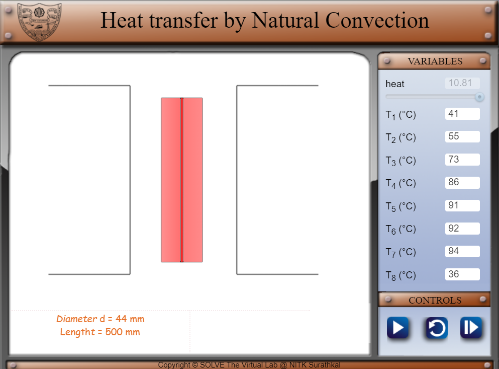
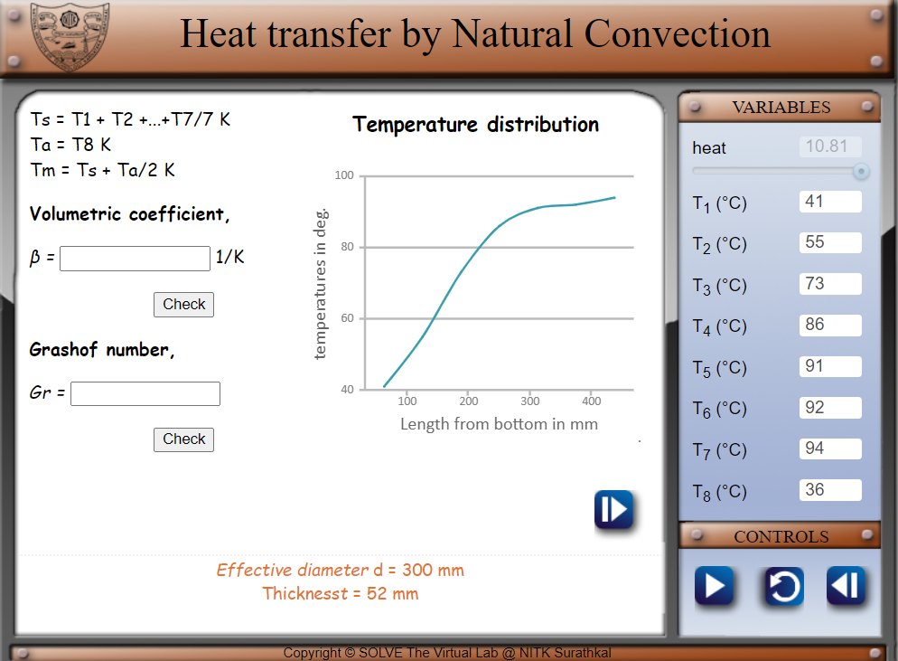
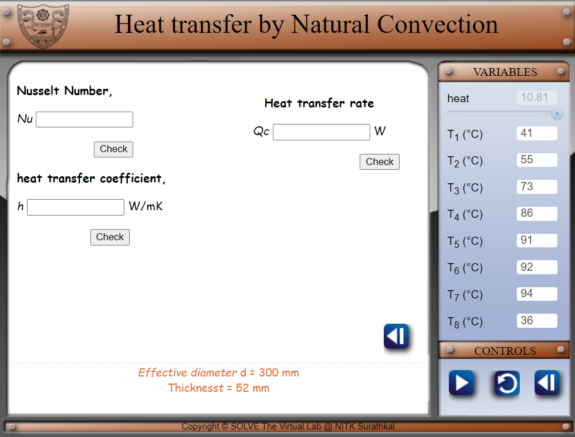

#### These procedure steps will be followed on the simulator

1. The following window appears after clicking on the simulation link. 
    

2. Give heat input to the heater by using the slider and adjust the voltage to the required value. Wait for 5 seconds for it to reach steady state. Note down the values of temperatures. 
    

3. Observe the graph, check your calculations with the results.. 
    

4. check your calculations with the results. And click on back if you want to move to previous slide. 
    
