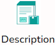
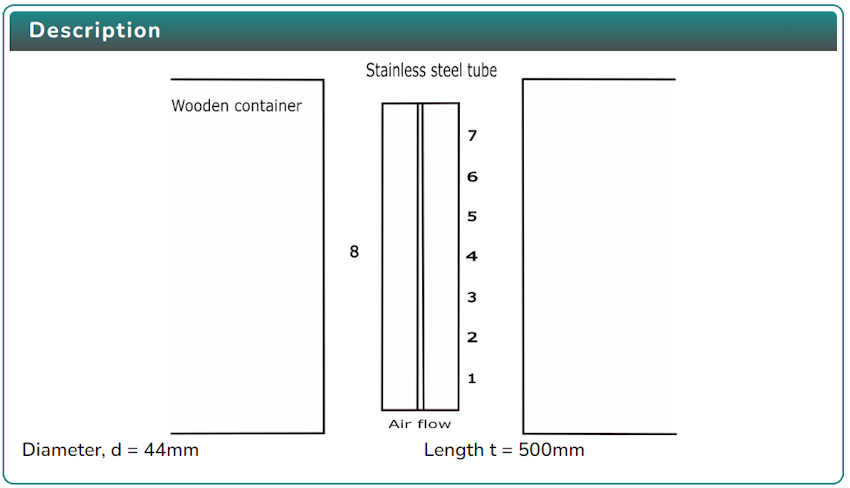
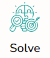

### Procedure

1. Click on the Objective icon  to view the Objective of the simulation.

   

2. Click on the Description icon  to view the description of the simulation.

   

3. Click on the Experiment icon  to view the experimental setup.

   

4. Select any one voltage value and click on the Start button  to perform the experiment, click on the Reset button  to reset the experiment.

5. After performing the experiment, click on the Solve icon 

   

6. Calculate the result and click Check button  to evaluate the result.
