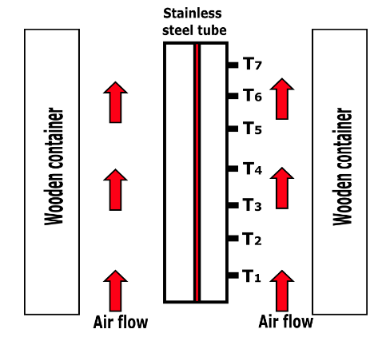
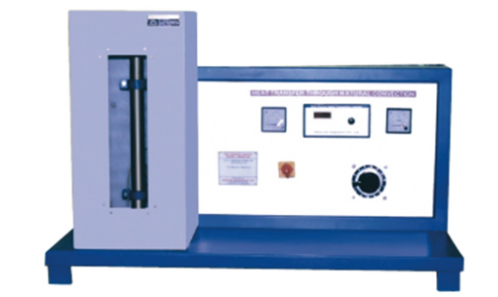

## INTRODUCTION 

#### User Objectives and Goals:

To determine the total thermal resistance of the composite slab

To determine the total thermal conductivity of the composite slab.

To plot the temperature vs distance graph

#### Theory
Natural convection heat transfer takes place by movement of fluid particles
on solid surface caused by density difference between the fluid particles on
account of difference in temperature. Hence there is no external agency facing
fluid over the surface as shown in Fig 1. It has been observed that the fluid adjacent to the surface
gets heated, resulting in thermal expansion of the fluid and reduction in its density.
Subsequently a buoyancy force acts on the fluid causing it to flow up the surface.
Here the flow velocity is developed due to difference in temperature between fluid
particles. Fig 2 shows experimental setup which demonstrates heat transfer by natural convection

  
Fig 1. Schematic representation of heat transfer by natural convection

  
Fig 2. Experimental setup demonstrating heat transfer by natural convection

The following empirical correlations may be used to find out the heat
transfer coefficient for vertical cylinder in natural convection.

Nu = 0.53 (Gr.Pr)^(1/4) for Gr.Pr<105

Nu = 0.53 (Gr.Pr)^(1/4) for 105<Gr.Pr<108

Nu = 0.53 (Gr.Pr)^(1/4) for 108<Gr.Pr<1012

Nu = Nusselt number

Gr = Grashof number

Pr = Prandtl number 
